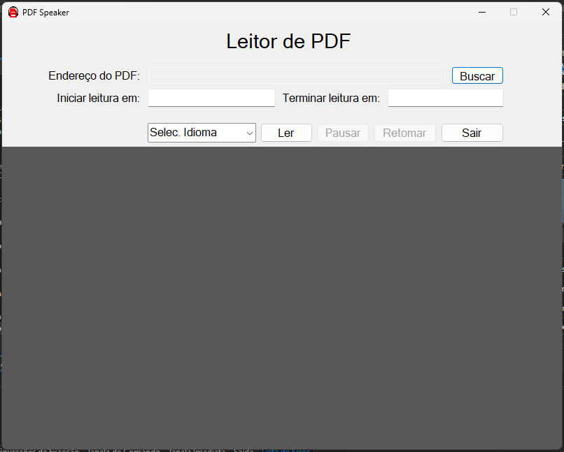

# PDF-Speaker
Sistema em C# para ler PDFs em voz.

## Sobre o sistema

 
Basta informar o diretório do arquivo em PDF, selecionar as páginas a serem lidas (não é obrigatório essa parte), informar o idioma a ser lido e dar o play.
Após isso, o documento será lido e poderá pausar e retomar quando desejar.
